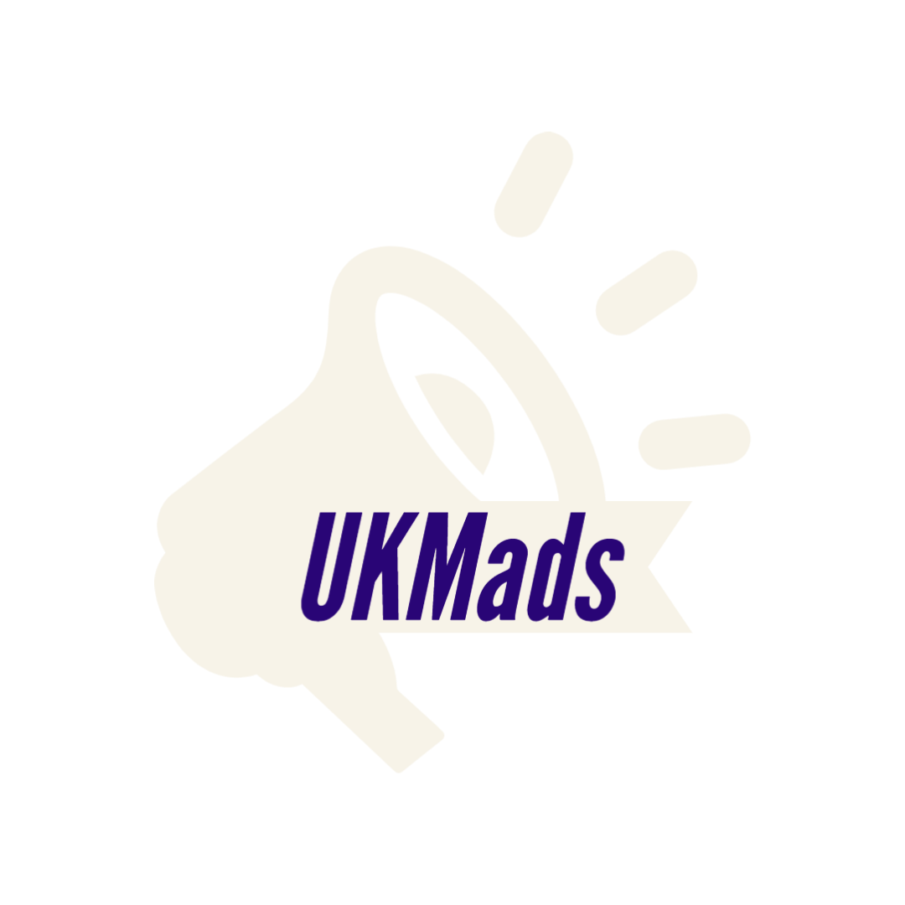

## About UKMads

UKMads is a platform for UKM community to advertise their business or events on one plaform with ease. The system is also a platform to notify students about any formal or main events held in the UKM.

## Frameworks Used

    &nbsp; &nbsp; &nbsp; &nbsp;

    &nbsp; &nbsp; &nbsp; &nbsp;

    &nbsp; &nbsp; &nbsp; &nbsp;

## Developers

- **[Nurfahkrullah bin Muslimin](https://github.com/NurfaNuva)**
- **[Putera Niq Aziz bin Hoslam](https://github.com/niqaziz17)**
- **[Muhammad Syazili bin Juhari](https://github.com/syazilijuhari)**
- **[Muhammad Danish bin Hairol Nizam](https://github.com/ViceNish)**
- **[Danish Irfan Shah bin Muzaffar Shah](https://github.com/DanishStampy)**

## Security Vulnerabilities

If you discover a security vulnerability within UKMads, please send an e-mail to Nurfakhrullah bin Muslimin via [a173823@siswa.ukm.edu.my](mailto:a173823@siswa.ukm.edu.my). All security vulnerabilities will be promptly addressed.

## License

The Laravel framework is open-sourced software licensed under the [MIT license](https://opensource.org/licenses/MIT).
